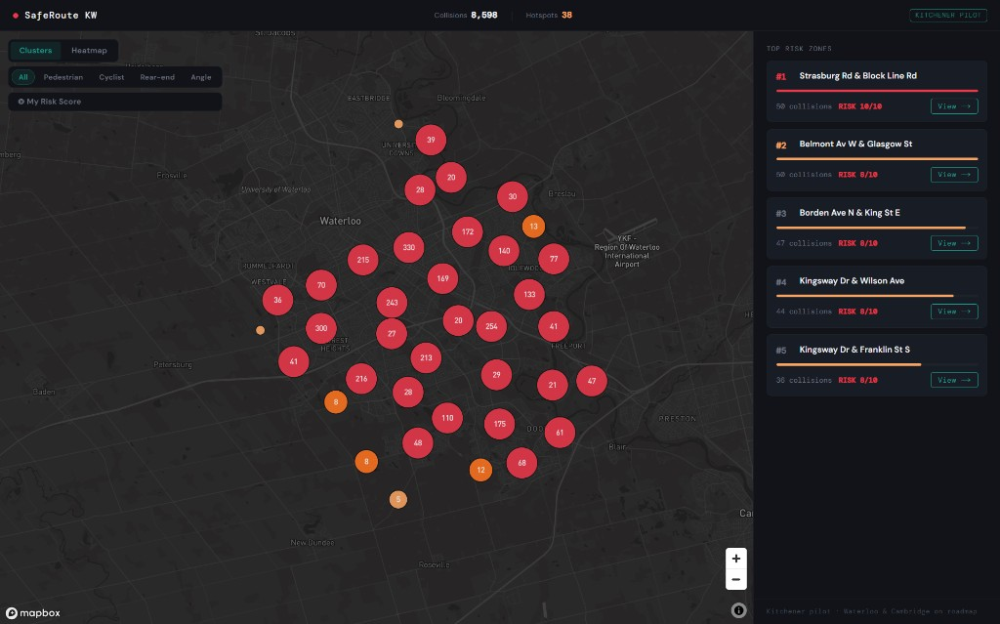

# SafeRoute KW


> **SafeRoute KW maps real Kitchener collision data to help students, cyclists, and drivers see which intersections are dangerous — and what it would take to fix them.**

🔗 **Live:** [saferouting.vercel.app](https://saferouting.vercel.app)

---



---

## What It Does

SafeRoute KW visualises 8,598 real vehicle collisions recorded in Kitchener between 2015 and 2022, plotted on a dark Mapbox map where intersection clusters are colour-coded from amber to red by risk score. Switch to heatmap mode for a density view of the entire city, or filter by collision type — pedestrian, cyclist, rear-end, or angle — to isolate exactly the patterns you care about. Click any intersection to see a rule-based analysis explaining why it's dangerous based on the actual collision breakdown, peak time, and severity rate, then hit **Simulate Fix** to see animated before/after safety scores and projected annual collision reductions for the recommended intervention. **My Risk Score** uses your browser's geolocation to find the highest-risk intersection within 5 km and surface it instantly. Every analysis can be exported as a plain-text report to your clipboard — ready to share with city planners or a professor.

---

## Features

- 🗺️ **Heatmap / cluster toggle** — switch between density heatmap and colour-coded hotspot clusters in one click
- 🔍 **Collision type filters** — filter by pedestrian, cyclist, rear-end, or angle collisions across the entire map
- 🏆 **Risk leaderboard** — ranked list of the top 5 most dangerous intersections in Kitchener
- 📍 **My Risk Score** — geolocation finds the highest-risk intersection within 5 km and opens its full analysis
- 📊 **Simulate Fix** — animated before/after safety scores, traffic flow, and collisions-per-year for the recommended infrastructure fix
- 📋 **Export report** — one-click copy of a structured intersection safety report to clipboard

---

## Tech Stack

| Layer | Technology |
|---|---|
| Framework | Next.js 14 (App Router) |
| Styling | Tailwind CSS |
| Map | Mapbox GL JS |
| Analysis engine | Custom rule-based TypeScript (no external AI) |
| Data | City of Kitchener Open Data (2015–2022) |
| Hosting | Vercel |

---

## Getting Started

```bash
git clone https://github.com/ajaykular/saferoute-kw.git
cd saferoute-kw
npm install
```

Create `.env.local` in the project root:

```env
NEXT_PUBLIC_MAPBOX_TOKEN=your_mapbox_token_here
```

Start the dev server:

```bash
npm run dev
```

Open [http://localhost:3000](http://localhost:3000).

---

## Data Source

Collision records are sourced from the **[City of Kitchener Open Data portal](https://www.kitchener.ca/en/city-services/open-data.aspx)**, covering **8,598 collisions** across all Kitchener intersections. Raw CSV records were cleaned, clustered by intersection, and enriched with risk scoring and collision-type breakdowns via a custom data pipeline.

---

## Challenges

- **Solo build in 24 hours** — full-stack product from raw data to deployed app in a single hackathon session
- **Real data pipeline** — transformed raw municipal CSV exports into a structured GeoJSON cluster format with risk scoring, severity rates, and collision-type proportions
- **No external AI** — the analysis and simulation engine is entirely rule-based TypeScript; every explanation and fix recommendation is generated deterministically from the collision data itself

---

## Roadmap

- **Region-wide KW coverage** — integrating Waterloo and Cambridge open data portals as the next milestone
- **Real-time traffic layer** — overlay live traffic conditions to correlate congestion patterns with collision hotspots
- **Exportable PDF reports** — formatted intersection safety reports for city planners and ward councillors

---

## Built By

**Ajay Kular** · [github.com/ajaykular](https://github.com/ajaykular)

Built at **[Hack to the Future](https://lauriercs.ca)** — Laurier Computing Society · March 2026
